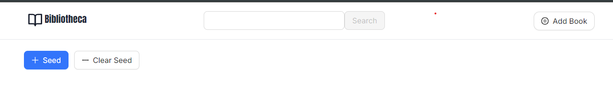
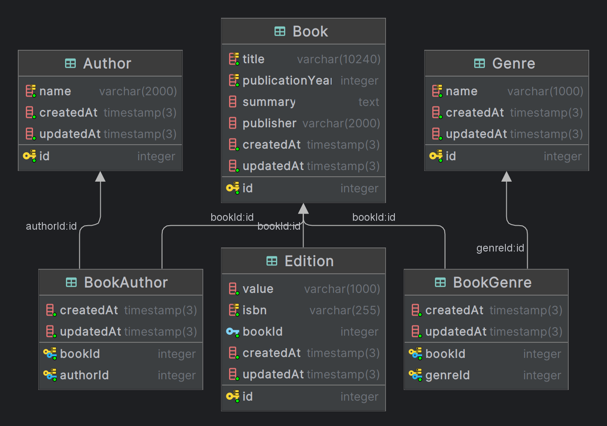

# Simple Digital Library

## Technology Stack

- #### Backend
    - NestJS
        - Nest has built-in support for typescript and modular architecture that makes it easy to organize and scale
          large
          applications.
        - Nest has built-in support for dependency injection (DI), validation, microservices, monolith etc that can
          help to test, maintain code out of the box.
    - Prisma (ORM)
        - Prisma has type-safety by generating typing in typescript, built-in migrations etc.
    - Jest (Test)

- #### Frontend
    - Next.js
        - Next is a React framwork supports server-side rendering (SSR), filter based routing, server components which
          simplifies the development process, optimizes performance, SEO etc.
    - Ant Design
    - Tailwind CSS
        - An easy to use CSS utility helps to design website using predefined building blocks.

- #### Database
    - PostgreSQL 15
        - Considering the requirements of the digital library, book records with fixed fields (title, summary, author
          etc), a SQL database likely be a suitable choice.
        - SQL provide transaction support, and strong consistency with ACID property which is required for book record
          integrity.
        - SQL can perform complex Queries which is required to retrieve data from book, author, genre etc entries.

- #### DevOps
    - Github Actions (CI/CD)
    - Docker (local run)

## Running the dockerize app

> [!NOTE]
> Make sure you have [docker](https://www.docker.com/) and [docker compose](https://docs.docker.com/compose/) installed
> in your machine.
> Docker compose version should be >= 2.2

There are three docker containers needed to run the app. One for backend, one for frontend and another for database.

```bash
# Clone the code to your local machine
$ git clone https://github.com/ahmed-dinar/digital-library.git

# Go to the app code directory
$ cd digital-library

# Running backend, frontend and database
$ docker-compose up -d

# To see the logs
$ docker-compose logs -f
```

## Use the app

* [Frontend](http://localhost:8080) is running on port [http://localhost:8080](http://localhost:8080).
* [Backend](http://localhost:3000) is running on port [http://localhost:3000](http://localhost:3000).

## Seeding the database

To seed the database with some demo book records:

* Go to [http://localhost:8080/backdoor](https://lib.dinar.sh/backdoor)
* Click the desired button to seed and clear seed as attached screenshot below.



## Performance Consideration

- ### Caching
    - Implement caching mechanisms to store frequently accessed book records to reduce database load and response time.
    - Tools like Redis or memcached can be used for caching.

- ### Load Balancing
    - Add multiple instance of server to balance the growing request.
    - Add a load balancer to distribute incoming traffic evenly across multiple instances.
    - This helps in scaling horizontally and handling increased user traffic effectively.

- ### Rate limiting
    - Add a rate limiter to prevent misuse and denial-of-service (DoS) attacks.
    - Currently we are allowing all users operation without authentication, we can limit request by user IP address
      within a specified timeframe.

- ### Containerize Scaling
    - We can utilize Docker and Kubernetes to achieve horizontal scaling.
    - By adding and removing containers based on the traffic, our app can handle traffic loads efficiently.

- ### Database Performance
    - We could reduce and limit some column length, E.g. book title, name etc to a meaningful limit.
    - We could add indexing on frequent used columns, E.g. book title, book summary (text search), author and genre
      name (search)
    - As the request grow, we could have database replicas. E.g. read and write replica
    - As the database grow, we could partition (Sharding) database into multiple shards.
    - We could have database cache to cache book entries as the read is more expected than write operations.
    - If we need to serve media files (book images, audio etc), we could use a object stores
    - Database backup can help to recovery of any data loss.

- ### Frontend Optimization
    - We could implement client-side caching and pagination to reduce the amount of data fetched from the server.
    - Use CDN to host frontend static assets (CSS, JavaScript) for faster loading times.
    - Utilize lazy loading for images and components for faster loading.

- ### Monitoring and Logging
    - Add logging to both server and frontend, we can track any errors and perform troubleshooting in production.
    - We could use tools like Sentry (error tracker), Hotjar, analytics (Google analytics etc) in frontend to track real
      time monitoring.
    - We could use GCP, AWS or other logs service in backend ot monitor incident real time.

## Further Improvements

- ### Frontend testing
    - We should add frontend unit and e2e testing to make the UI UX quality better and consistent.
    - Framework like Playwright, Cypress can be used to test UI.

- ### Authentication and Authorization
    - We could introduce authentication before perform any modification (create, update, delete).
    - We could have authorization to limit perform modification only books that are owned by a user.

- ### Backend error mapping
    - We could add more meaningful error from backend. E.g. adding error codes to error type can help to debug
      production errors.

- ### Internalization
    - We could add support for multiple languages to provide users more better experience.
    - Next.js has built-in i18n supports we can utilize that.

- ### User specific features
    - Features like add a book to favourite, track reading progress, add to user collections can help user to find the
      app more useful.
    - Suggested books based on user interaction and reading history can improve UX better.
    - A socializing feature like an user can add other user as a friend and see/share their interests among friends.

- ### Additional features
    - Information validation based on user votes (genres attached to book, author etc) can help the reliability of
      contents.
    - Like, comment, rating on books can improve interest of users.
    - Introduce audio book supports to listen to the book.
    - A pdf/ebook reading experience built int in the app.

## Current Database Design

- We have four tables. `Book`, `Author`, `Genre` and `Edition`.
- Books are unique across the system by their title.
- Authors are unique across the system by their name.
- Genres are unique across the system by their name.
- A Book can be associated to multiple Authors and Genres and vice versa.
- A new edition of book should have have a unique ISBN associated to it.



## Development

### Please find the development guides in [server](/server) and [client](/client) directory readme.

## License

License under MIT please find the file [here](LICENSE).


